# MEMORY - Team 19

This is not just a simple version of the popular game memory, but an
adventure. Following, you will receive an insight into the game
structure and all the features one can explore. When referencing a
certain part of a screen with a number, this will be indicated by
enclosing the number in brackets, i.e.: (1).

**Content**  
1. [Starting the Application](#1.StartingtheApplication)

2. [Singleplayer](#2.Singleplayer)   2.1
   [Single Player Mode](#2.1SinglePlayerMode)   2.2
   [Name Selection](#2.2NameSelection)   2.3
   [Level Selection](#2.3Levels)   2.4
   [Singleplayer Lives](#2.4SinglePlayerLives)   2.5
   [Singleplayer Time](#2.5SinglePlayerTime)   2.6
   [Singleplayer Game Result](#2.6SinglePlayerGameResult)  

2. [Multiplayer](#3.Multiplayer)   3.1
   [Number of Players](#3.1.NumberOfPlayers)   3.2
   [Name Selection](#3.2.NameSelection)   3.3
   [Game Multiplayer](#3.3.GameMultiPlayer)   3.4
   [Multiplayer Game Result](#3.4.MultiPlayerGameResult)  
3. [Highscore History](#4.Highscore)
4. [Console](#5.Console)
  
  
## <a name="1.StartingtheApplication"> 1. Starting the Application</a>

Running the program will open the Start Screen (Main Menu). Here, the player
can choose between playing:
- As a lone hero ( [Singleplayer](#2.Singleplayer) ) (2)
- A heroic battle ( [Multiplayer](#3.Multiplayer) ) (4)

Through the "EXIT" button (1), a player can close the application. The player can
also have a look at the [Highscore](#4.Highscore) (3).

*[StartScreen.fxml](src/main/resources/de/uni_passau/se/memory/gui/StartScreen.fxml)*

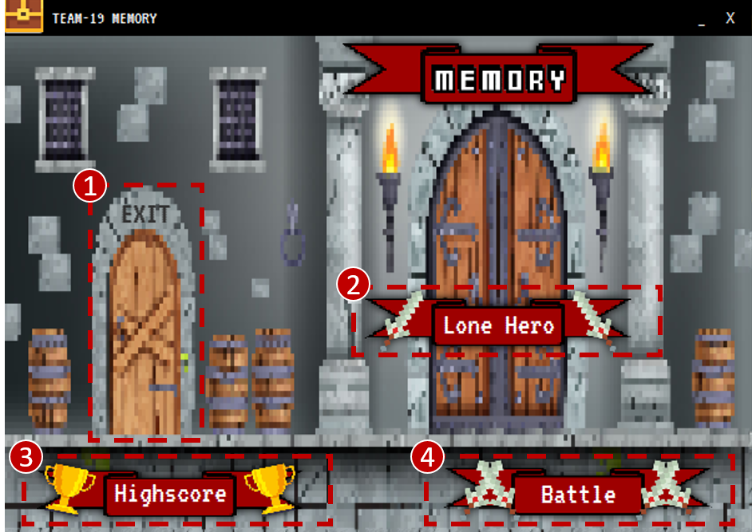

**Actions when clicking...:**

(1) The window will close and the program will stop

(2) A new window will open to choose the [Singleplayer](#2.Singleplayer)
mode

(3) A new window will open, showing the
[Highscore History](#4.Highscore). This is a list of the highest
scores that have been achieved by players.

(4) A new window will open in which the player can choose the
[Number Of Players](#3.1.NumberOfPlayers) they want to play against in a
[Multiplayer](#3.Multiplayer) game.
  

## <a name="2.Singleplayer"> 2. Singleplayer</a>

### <a name="2.1SinglePlayerMode"> 2.1 Singleplayer Mode</a>

*[SinglePlayerMode.fxml](src/main/resources/de/uni_passau/se/memory/gui/SinglePlayerMode.fxml)*

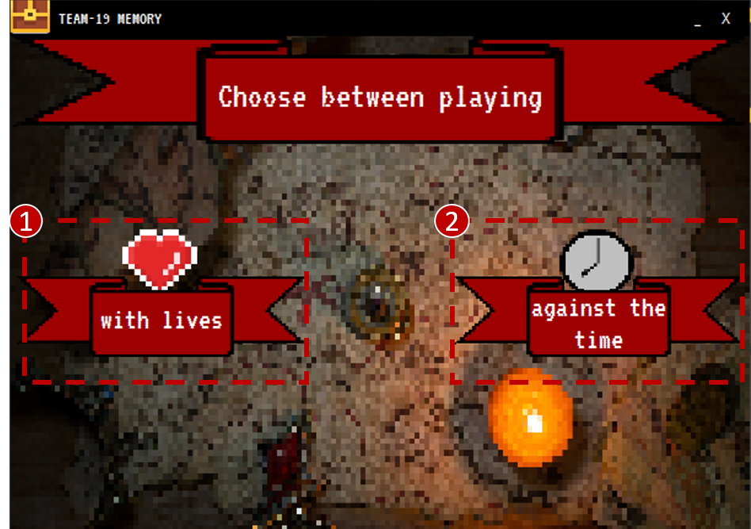

**Actions when clicking...:**

(1) One will play [with lives](#2.4SinglePlayerLives).

(2) One will play [against the time](#2.5SinglePlayerTime).
  
### <a name="2.2NameSelection"> 2.2 Name Selection</a>

In this screen the player can choose the name they prefer. This name will then
be displayed during the game. If the player does not want to choose a name, they
can click (3) and the default name "Player 1" will be set. They can also
choose to play with a profile (1). A profile can store all of the players
achievements and highscores. Should the player win a game or receive a new
achievement, this will be stored. The input name has to be the same one
a player used before as a profile. Otherwise, a new profile will be created.

*[NameSelection.fxml](src/main/resources/de/uni_passau/se/memory/gui/NameSelection.fxml)*

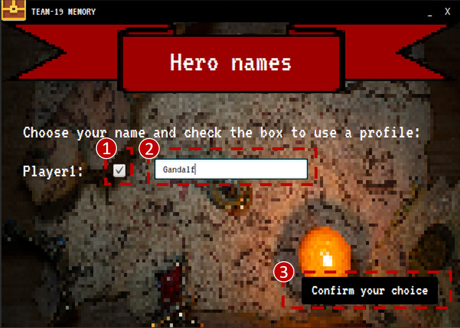

**Functions when clicking/inputting...:**

(1) The player wants to play with a profile. An existing profile will be used or a new one will be generated.

(2) This input will be displayed during the game and in the
[Highsore History](#4.Highscore)

**Actions when clicking...:**

(3) The player's choices will be saved, and a new window will open to choose the
[level](#2.3Levels) they want to play.
  
### <a name="2.3Levels"> 2.3 Level Selection</a>

Here, the player can choose between three different levels with different
difficulties. As described in the screenshot, the levels are:
- Level 1 >> The player will play with a 4x4 board, e.g. 16 Cards (
  [Example](#2.4SinglePlayerLives) )
- Level 2 >> The player will play with a 6x6 board, e.g. 36 Cards (
  [Example](#3.3.GameMultiPlayer) )
- Level 3 >> The player will play with a 8x8 board, e.g. 64 Cards

*[Levels.fxml](src/main/resources/de/uni_passau/se/memory/gui/Levels.fxml)*

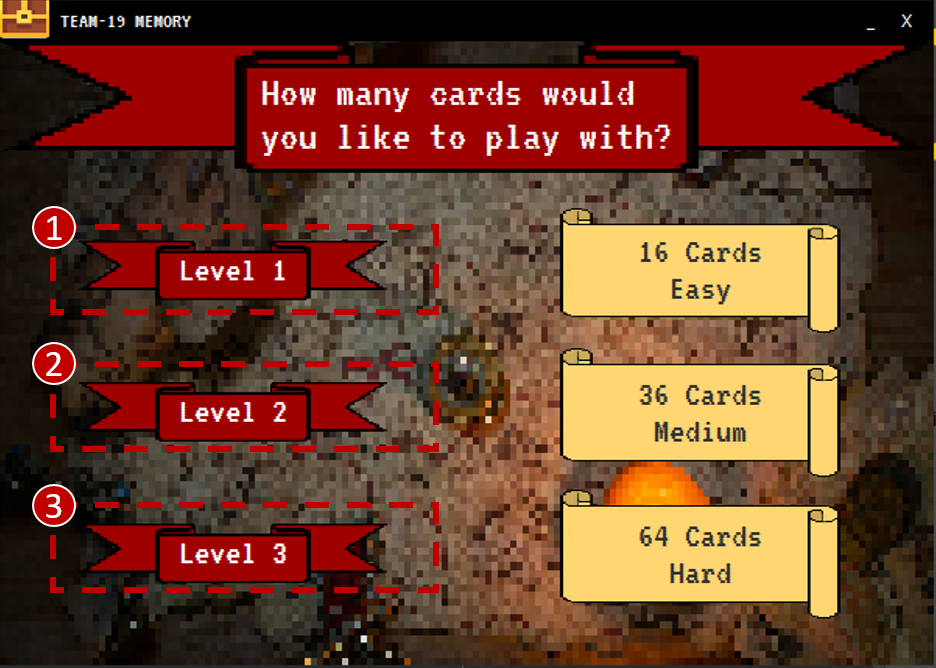

**Actions when clicking...:**

(1) or (2) or (3) A new game ( [with lives](#2.4SinglePlayerLives) /
[against the time](#2.5SinglePlayerTime) ) will start with the selected
difficulty level (described above).

  
### <a name="2.4SinglePlayerLives"> 2.4 Singleplayer Lives</a>

Depending on the [Level](#2.3Levels) the player has chosen before, the game
will be generated. Also, the number of lives will adjust according to
the level:
- Level 1 >> 8 lives
- Level 2 >> 18 lives
- Level 3 >> 30 lives

If the player manages to find all matching pairs before they run out of
lives, they win the game.

*[Game.fxml](src/main/resources/de/uni_passau/se/memory/gui/Game.fxml)*

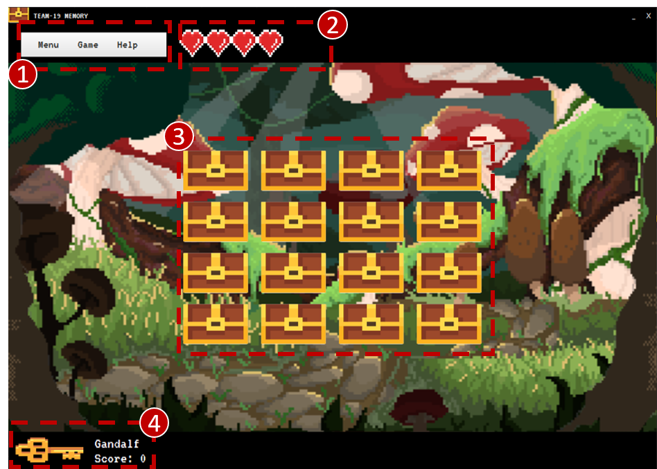

**Display:**

(2) This area displays the lives the amount of lives remaining. Each heart
represents two lives (two half lives). Here, [Level](#2.3Levels) 1 is
chosen and therefore 4 hearts (8 lives) are displayed and played with.
This area will be updated after every turn and can not be altered by the
player. If there are no more lives left, the game is lost.

(3) This area represents the playing field and is showing the
cards/chests. It is the main part of the game. Here, [Level](#2.3Levels) 1 is chosen, and therefore 16 cards/chests are
displayed.

(4) Here, the chosen [name of the Player](#2.2NameSelection) as well as
their score is displayed. If a player finds a matching pair, their score
is updated. The key next to the player symbolizes their turn (this will be
relevant in the [Multiplayer](#3.Multiplayer) ).

**Actions when clicking...:**

(1) Here, a game menu can be accessed, offering the following actions:
- Menu:
  - Main Menu >> The player can return to the
    [Start Screen](#1.StartingtheApplication). All their progress will
    be lost.
  - Exit >> The game will be ended and the program will close
- Game:
  - Try again >> The game will start again with the same settings. All
    progress will be lost.
- Help:
  - Rules >> A new window, displaying the rules of the game, will be
    shown.

(3) The player can choose any card they want to display, e.g. the chest
they want to open. By clicking on a chest, the content is displayed and
the player can choose a second chest. If the player tries to open the
chest twice, nothing will happen until they choose a different one. An
example is given in the image below.
  
  
*[Game.fxml](src/main/resources/de/uni_passau/se/memory/gui/Game.fxml)*

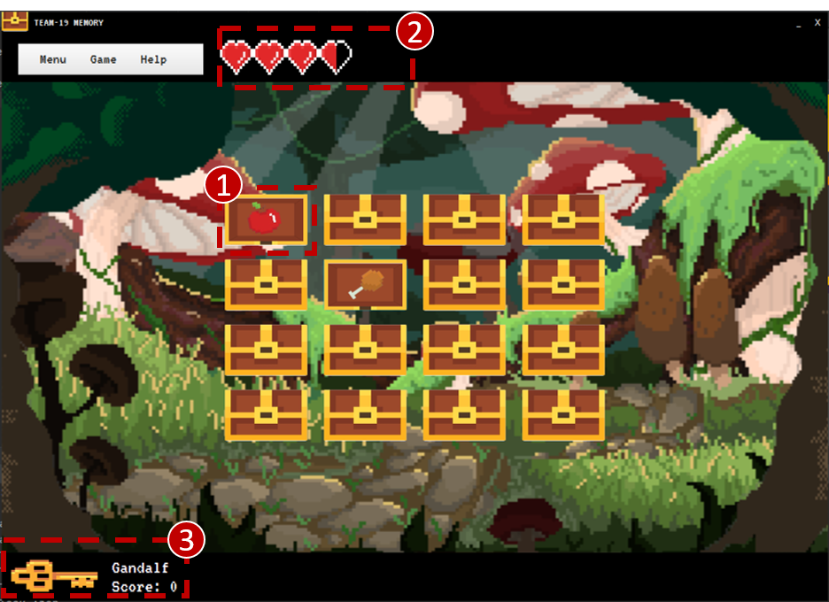

**Display:**

(1) The chosen chests will remain open until the player makes their next
move. In this case, the cards do not match and are therefore not removed
from the playing field. In the next turn, the player can choose
two cards again. Choosing one of the already open cards will
only leave this one open, while the other one is closed again.

(2) As the chosen pair of chests do not match, a life is subtracted (7
remain).

(3) As no matching pair was found, the score of the player does not
increase.
  
  
*[Game.fxml](src/main/resources/de/uni_passau/se/memory/gui/Game.fxml)*

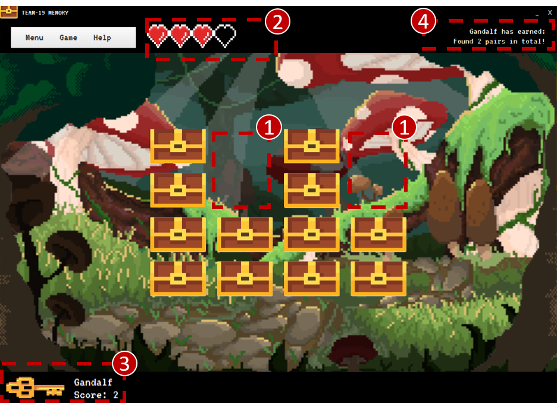

**Display:**

(1) Here, two matching pairs have been found and are therefore removed
from the playing field. The structure (position of the chests) remains
the same.

(2) As previously another turn was unsuccessful, another life was
subtracted. However, as the next two turns were successful, no further
life was subtracted (6 lives remain).

(3) The score is being updated according to the pairs found, i.e. one
pair found = one point.

(4) In this area, all achievements are displayed. In this case, the
player found two pairs in total and is being rewarded.
  
### <a name="2.5SinglePlayerTime"> 2.5 Singleplayer Time</a>

Depending on the [Level](#2.3Levels) the player has chosen before, the game
will be generated. Also, the time will adjust according to the level:
- Level 1 >> 120 seconds
- Level 2 >> 240 seconds
- Level 3 >> 360 seconds

The functions are the same as in the
[game with lives](#2.4SinglePlayerLives). Only the hearts are replaced
by a Countdown. If the player manages to find all matching pairs before
the timer runs out, they win the game.

*[Game.fxml](src/main/resources/de/uni_passau/se/memory/gui/Game.fxml)*

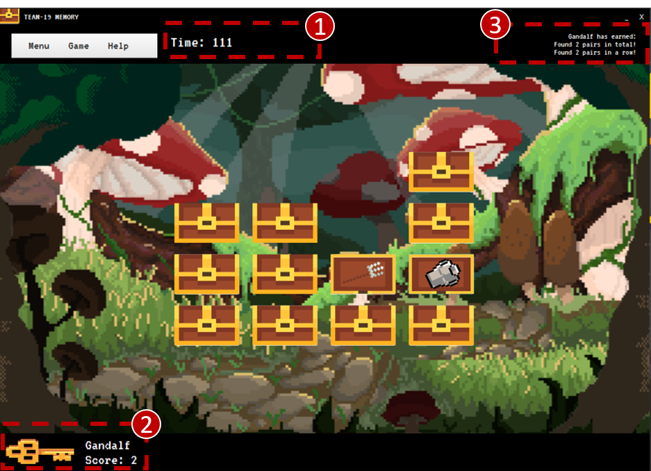

**Display:**

(1) In this area, a countdown timer is displayed and updated every
second. If the timer reaches zero, the game is lost. The timer is not
affected when a pair of chests did not match.

(2) The score is updated when a matching pair was found.

(3) Here, the player was able to find two matching pairs in a row and is
rewarded accordingly.
  
### <a name="2.6SinglePlayerGameResult"> 2.6 Singleplayer Game Result</a>

If the player manages to find all pairs before they run out of
[lives](#2.4SinglePlayerLives) or [time](#2.5SinglePlayerTime), they
have won the game and the window below will open. If the player has
chosen to play with a profile and they have set a new Highscore, they are
added to the [Highscore History](#4.Highscore) .

*[GameResult.fxml](src/main/resources/de/uni_passau/se/memory/gui/GameResult.fxml)*

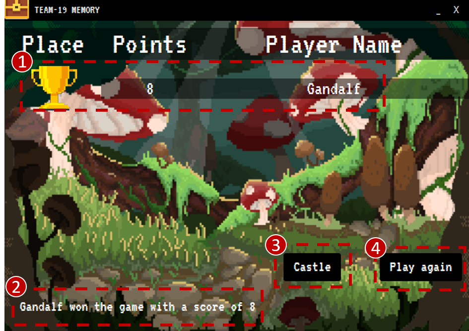

**Display:**

(1) Here, the place the player has reached (only one place in
[singleplayer](#2.Singleplayer) ), the points they have scored as well
as the players name is displayed.

(2) All the achievements the winning player has earned are shown here.

**Actions when clicking...:**

(3) The player will be brought back to the
[Start Screen](#1.StartingtheApplication)

(4) The player is able to play again with the same settings. The chests
are shuffled again. [Lives](#2.4SinglePlayerLives) /
[time](#2.5SinglePlayerTime) are reset.      
  
If the player does not manage to find all pairs before they run out of
[lives](#2.4SinglePlayerLives) or [time](#2.5SinglePlayerTime), they
lose the game and the window below will open.

*[GameResult.fxml](src/main/resources/de/uni_passau/se/memory/gui/GameResult.fxml)*

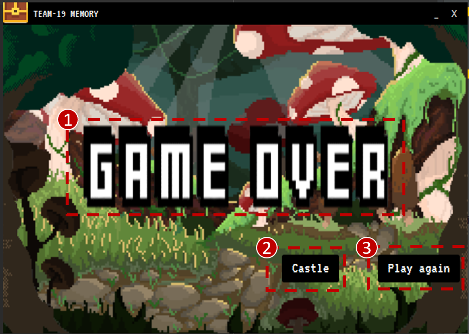

**Display:**

(1) This will be displayed if a game was lost.

**Actions when clicking...:**

(2) The player will be brought back to the
[Start Screen](#1.StartingtheApplication)

(3) The player is able to play again with the same settings. The chests
are shuffled again. [Lives](#2.4SinglePlayerLives) /
[time](#2.5SinglePlayerTime) are reset.
  
##  3. Multiplayer

Here, a player can play against friends and family. A player can play
against up to 3 others.

###  3.1 Number of Players

Before starting to play, the player has to choose the number of players
they want to play against in the screen below.

[NumberOfPlayers.fxml](src/main/resources/de/uni_passau/se/memory/gui/NumberOfPlayers.fxml)*

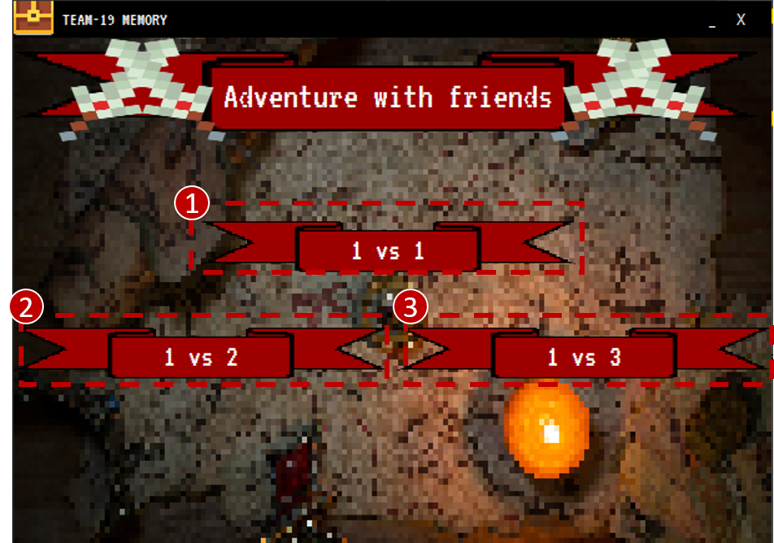

**Actions when clicking...:**

(1) The player will play against one opponent and
[Name Selection window](#3.2.NameSelection) opens.

(2) The player will play against two opponents and
[Name Selection window](#3.2.NameSelection) opens.

(3) The player will play against three opponents and
[Name Selection window](#3.2.NameSelection) opens.
  
###  3.2 Name Selection

Same as in the [Name Selection in Singleplayer](#2.2NameSelection), all
the players can input a name of their choosing.

*[NameSelection.fxml](src/main/resources/de/uni_passau/se/memory/gui/NameSelection.fxml)*

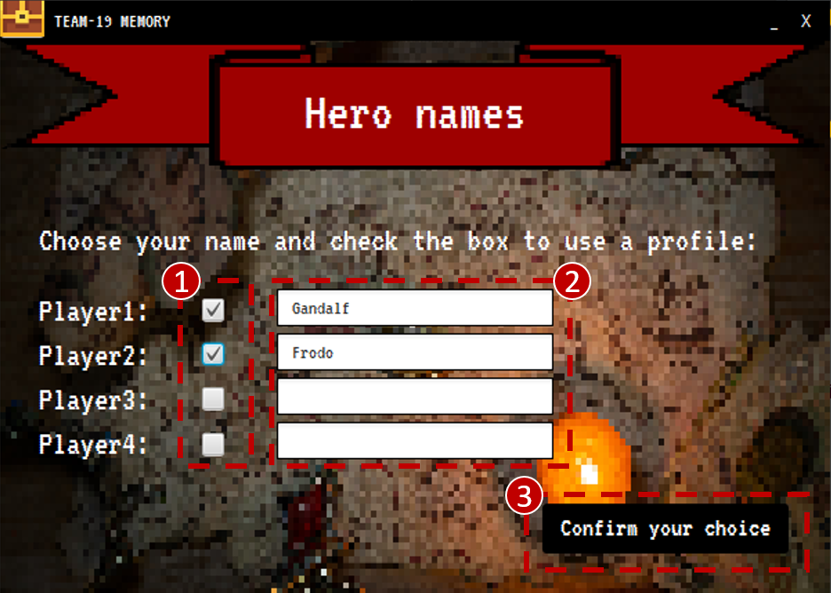

**Functions when clicking/inputting...:**

(1) Enabling to play with a profile. If a profile name matches an
existing name, this one will be used.

(2) This input will be displayed in the [game](#3.3.GameMultiPlayer) and
in the [Highsore History](#4.Highscore)

(3) Will open the [Levels](#2.3Levels) selection window same as in the
[Singleplayer](#2.Singleplayer) mode.
  
###  3.3 Game Multiplayer

By choosing the player names and the prefered level, the game below
was generated for multiplayer mode. Here, there are no lives or time
given. This time a 6x6 playing field was chosen (level 2). The functions
of the chests or playing field do not differ from the ones used in the
[Singleplayer game](#2.4SinglePlayerLives). Furthermore, the Menu in the
top left corner is also the same as described before.

*[Game.fxml](src/main/resources/de/uni_passau/se/memory/gui/Game.fxml)*

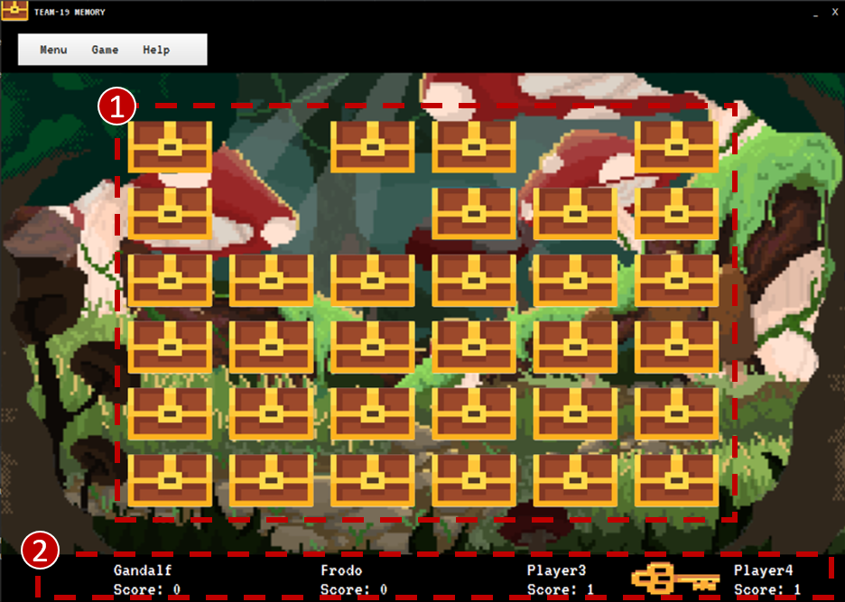

**Display:**

(1) Chest are being displayed and removed when a matching pair was
found.

(2) According to the Name Selection, the names chosen are displayed
here. As two of the players did not chose a name, the default name was
assigned. According to the rules of memory, ones a player opened a pair
of chests that did not match, the nexts players turn starts. This is
indicated by the key next to the players. Points are only given to the
player that found a matching pair.
  
  
*[Game.fxml](src/main/resources/de/uni_passau/se/memory/gui/Game.fxml)*

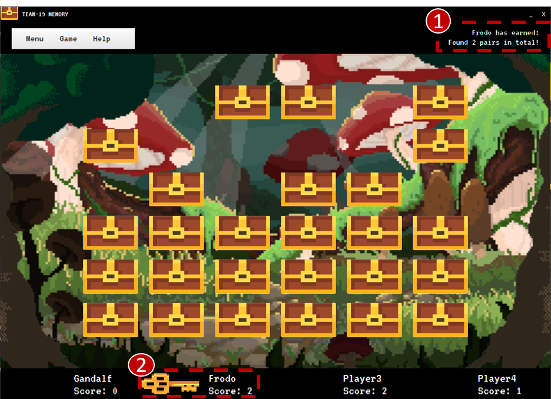

**Display:**

(1) The key is next to "Frodo" and therefore it is still this players turn.

(2) Achievements of each player are displayed in the top right corner.
  
###  3.4 Multiplayer Game Result

*[GameResult.fxml](src/main/resources/de/uni_passau/se/memory/gui/GameResult.fxml)*

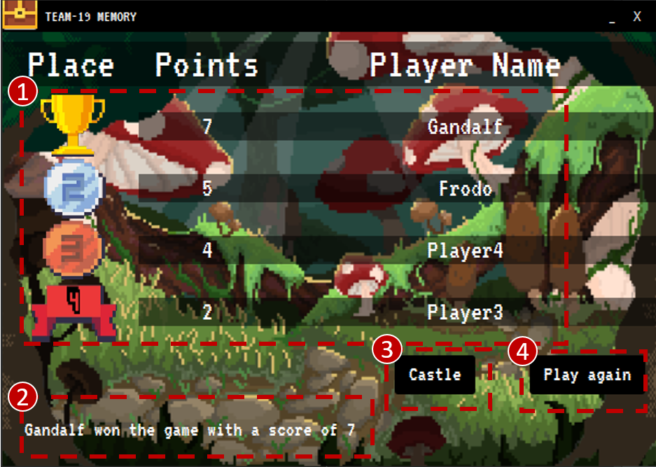

**Display:**

(1) Here, the place the players have reached, the points they have scored
as well as the players names are displayed.

(2) All the achievements the winning player has earned are shown here.

**Actions when clicking...:**

(3) The player will be brought back to the
[Start Screen](#1.StartingtheApplication)

(4) The player is able to play again with the same settings. The chests
are shuffled again.
  
##  4. Highscore History

When players have chosen to play with a profile in the [Multiplayer Name
Selection](#3.2.NameSelection) or
[Singleplayer Name Selection](#2.2NameSelection), their achieved score
will be shown here, provided they have beaten an existing Highscore.
 
*[HighScore.fxml](src/main/resources/de/uni_passau/se/memory/gui/HighScore.fxml)*

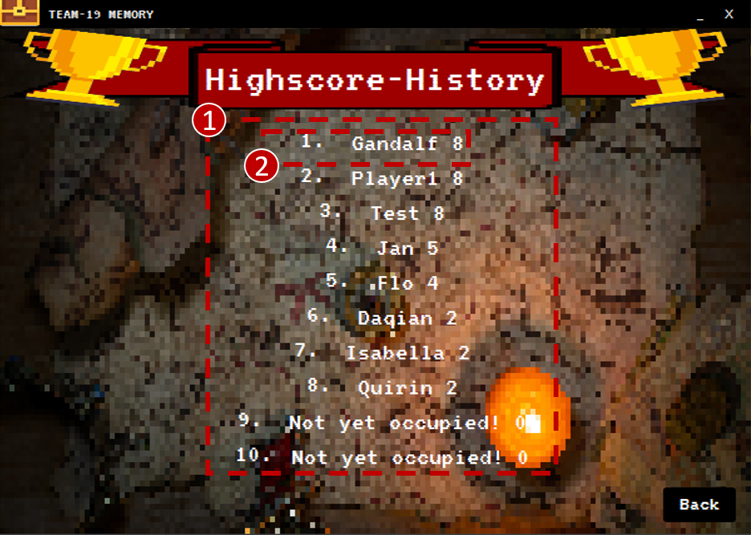

**Display:**

(1) All the players that have managed to get onto the Highscore List

(2) Here, the chosen profile from the Singleplayer example was created,
alongside the
[score the player receive in that game](#2.6SinglePlayerGameResult).
Although the player also used their profile in the
[Multiplayer game](#3.3.GameMultiPlayer), the Highscore remains at 8.
This is because the player only achieved a
[score of 7 in the Multiplayer game](#3.4.MultiPlayerGameResult).
  
##  5. Playing on the console

When playing on the console, most features are the same:
- Playing with lives
- Playing against the time
- Graphical interface

Features only available on the console:
- Playing the exact same game again
- Playing a 2x2 playing field

